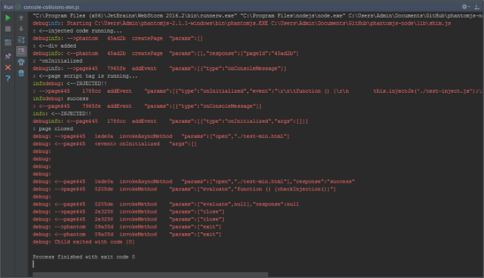
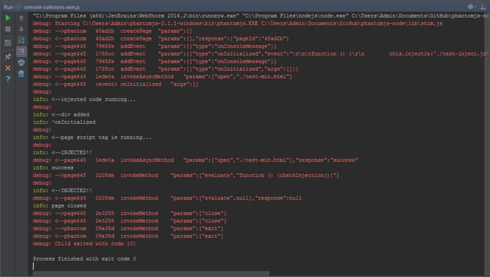

## de-collide-console ##
### Motivation ###
Console MUX to coordinate `stdout` and `stderr` to work around a [bug in Webstorm](https://youtrack.jetbrains.com/issue/WEB-23329).  Because the two streams are not coordinated this happens...
 


### Method ###
The two output streams are hooked and all transmissions are wrapped in promises to write after a fixed delay.  The promises are chained to maintain the order of the transmissions.  The module exports a constructor that takes a argument which is the delay between transmissions in milliseconds.  The queue will expand as required and a `drain` event will be emitted after the last member has been sent.  Because the writes are asynchronous, the drain event needs to be used to `unhook` after all writes are completed, otherwise there would be collisions as the queue empties after being unhooked.

A timeout is provided in the unlikely event that the the streams hang.  If this happens an error event will fire which the consumer can chose to handle.  Similarly, if there is a stream error the remaining queue will be skipped and the error reported to the consumer.

Just add the following code...

```js
var Decollide = require('de-collide-console');

new Decollide(10);
Decollide.on('drain' ,() => {
  Decollide.unhook();
});
```

The collisions are removed...



